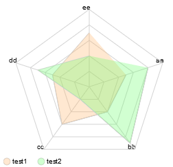

# SpiderChart

A minimalistic radar (spider) chart script displaying 5 values in a pentagon.

Just SpiderChart.js is needed, other files are examples and docs.

# Implement

## the shortest way without values
```html
<canvas id="chart"></canvas>
<script src="SpiderChart.js"></script>
<script>
    let sc = new SpiderChart('chart',250,250);
    sc.renderGraph(6);
</script>
```
result:


## all possible options
### initializing
```javascript
let sc = new SpiderChart('chart',250,250);
```
parameters:
- id,
- height
- width

### entities
```javascript
let entity_one = {
            "id": 'test1',
            "data": [
                50,
                40,
                60,
                50,
                70
            ],
            "color": 'rgba(255, 178, 102, 0.3)'
        }
sc.addEntity(entity_one);
```
- an entity requires an id, data and color attribute.
- data requires an array with 5 int values, that represent a percent value

### offset
```javascript
sc.setOffset(1.05);
```
int value that moves the y center

### grid display
```javascript
sc.setGrid('lightgray', 1, 0.5);
```
parameters:
- color
- strike width
- opacity

### corner captions
```javascript
sc.setParams(['aa','bb','cc','dd','ee']);
```
array with 5 strings

### render graph
```javascript
sc.renderGraph()
```
renders pentagram chart with given options

### render legend
```javascript
sc.renderLegend();
```
renders list of first 5 entity id's at the bottom.

### result
